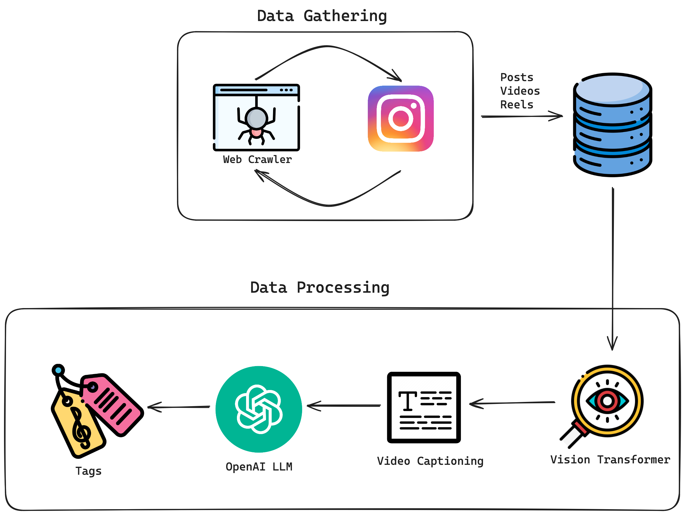

# Feedom - Freedom from the Feed

Feedom allows users to experience the same engaging content from platforms like Instagram and TikTok but with a crucial difference: the algorithm is fully controlled by the user.
Feedom allows users to experience the same engaging content from other similar platforms, but instead of the platforms determining what to watch, the content will be decided by the user themselves.
The user can personalize the feed according to their moods.

## System Diagram: Data Processing



## System Diagram: Recommendation Algorithm


# Steps to run the application:

1. Clone the repository <br/>
   ```
   https://github.com/HarinKhakhi/feedom.git
   ```
2. Create an env file and add API_KEYs for OpenAI and MongoDB.
   
3. Start frontend <br/>
   ```
   cd frontend 
   npm i      
   npm run dev
   ```
4. Start backend <br/>
   ```
   cd backend
   pip install -r requirements.txt
   fastapi dev backend.py
   ```
